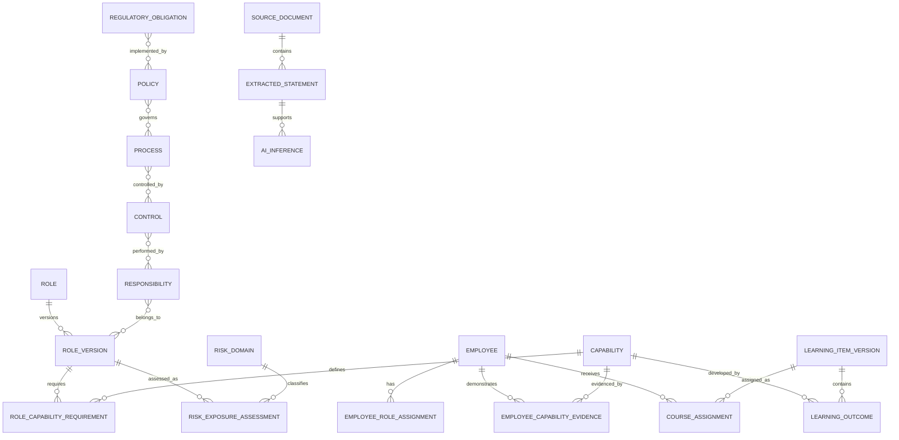

# Vidda Role, Capability, Risk and Training Management System

Status: Implementation-ready product specification  
Scope: Regulated banks and financial institutions  
Reference scenario: Retail Banking Relationship Manager  
Document version: 1.0  
Prototype mode: Deterministic data and predefined AI responses  

> Vidda is a governance, decision-support, evidence and workflow platform. It does not guarantee regulatory compliance. Each institution’s Compliance and Legal functions must approve applicable interpretations.

## 1. Executive overview

Vidda Role Intelligence establishes a versioned chain from what an employee is responsible for to what they must be able to do, why that ability matters, how it is evidenced and when it must be reassessed. It replaces job-title-based annual course assignment with continuously maintained, role-specific capability evidence.

The platform:

1. Maintains canonical role families and effective-dated local variants.
2. Extracts responsibilities, authority and exposure from authorized HR, policy and control documents.
3. Routes inferred, contradictory and low-confidence information to named human reviewers.
4. Derives role capability requirements at five proficiency levels.
5. Calculates transparent inherent and employee-specific risk exposure.
6. Consolidates simultaneous primary, secondary, temporary and delegated roles.
7. Selects learning and evidence interventions without unnecessary duplication.
8. Preserves the exact rationale, source, model version, approvals and calculation snapshot.
9. Reassesses impacted employees after role, regulatory, policy, risk, access or status changes.

## 2. Business objectives

| Objective ID | Objective | Outcome measure |
|---|---|---|
| OBJ-001 | Standardize role expectations across entities while preserving local variants | At least 95% of in-scope employees mapped to an approved role version |
| OBJ-002 | Explain what each employee must know and demonstrate | 100% of mandatory capability requirements have source and rationale |
| OBJ-003 | Reduce generic and duplicate training | Duplicate seat-time reduced without loss of capability coverage |
| OBJ-004 | Detect uncovered regulatory and operational responsibilities | Unowned obligations, controls and high-risk activities reported daily |
| OBJ-005 | Evidence capability beyond completion | Critical capabilities require practical or observational evidence |
| OBJ-006 | Respond quickly to change | Impacted roles and employees identified within configured SLA |
| OBJ-007 | Support audit reconstruction | Every mandatory assignment reproducible from immutable snapshots |
| OBJ-008 | Protect employees from unsupported automation | No AI inference creates mandatory or adverse action without approval |

## 3. Banking governance principles

1. **Applicability before assignment.** Jurisdiction, legal entity, regulatory perimeter, business line and effective date are resolved before obligations are mapped.
2. **Human accountability.** AI proposes; authorized people approve. High/Critical role and risk decisions require four-eyes review.
3. **Evidence, not attendance.** Completion is evidence of participation, not automatic proof of capability or control effectiveness.
4. **Source traceability.** Every requirement points to an exact source version and passage.
5. **Effective dating.** Roles, obligations, policies, mappings, learning items and decisions remain historically reproducible.
6. **Data minimization.** Employee data is used only for authorized capability and governance purposes.
7. **No automated adverse decision.** AI outputs and learning results cannot independently drive disciplinary, compensation or employment decisions.
8. **Local configurability.** Global templates can be narrowed or supplemented by approved local variants; local rules cannot silently weaken a binding group requirement.
9. **Defence-line integrity.** Ownership, operation, oversight and assurance responsibilities remain distinguishable.
10. **Fail controlled.** If AI or an integration is unavailable, approved rules and manual review queues continue.

## 4. User personas and access model

Permissions are scoped by tenant, legal entity, jurisdiction, business unit and data purpose. `A` = approve, `C` = create, `R` = read, `U` = update, `X` = export/audit.

| Persona | Roles | Employee mappings | Capabilities | Risk | Learning | Sources/AI | Evidence |
|---|---|---|---|---|---|---|---|
| Employee | R own published | R own | R own | R own explanation | R own, acknowledge | R cited extracts | C/R own |
| Line manager | R team | C/U team, validate | R team | R team factors | recommend, validate | R | C manager observation |
| Role owner | C/U, A non-critical | R | C/U requirements | R | recommend | R | R |
| HR administrator | C/U metadata | C/U, validate employment | R | no incident detail | R status | C HR sources | R limited |
| Learning administrator | R | R scope | R | R level only | C/U catalog/assignment | R | R completion |
| Compliance officer | C/U regulatory fields, A | validate critical | C/U/A compliance | C/U/A | A mandatory | C/U/A sources | R/X |
| AML/CFT officer | A AML roles | validate AML | C/U/A AML | C/U/A AML | A AML | C/U AML sources | R/X AML |
| Risk manager | A High/Critical | validate critical | C/U | C/U/A/override | A risk-triggered | R | R/X |
| Data-protection officer | A privacy fields | R minimized | C/U privacy | C/U privacy | A privacy | C/U privacy sources | X privacy |
| Information-security officer | A privileged roles | validate access | C/U cyber | C/U cyber | A cyber | C/U security sources | X security |
| Internal auditor | R | R | R | R | R | R | X all, no mutation |
| Regulatory affairs | C/U obligations | R aggregate | R | R | R | C/U/A regulation | X packs |
| AI/model-risk specialist | R | no employee detail by default | R | R model inputs | R logic | C/U model config, A validation | X AI logs |
| System administrator | metadata only | technical support | taxonomy config | threshold config | integration config | model endpoint config | technical logs |
| External auditor/regulator | time-limited R | controlled R | R | R | R | R sources | X approved pack |

### Access controls

- Privileged actions require step-up authentication.
- Maker cannot approve their own critical role, learning content or override.
- Sensitive incidents and findings use purpose-based field masking.
- Employee access shows applicable personal data, rationale and correction route.
- Works-council restrictions can disable named ranking, manager visibility or specific employee modifiers.

## 5. Functional architecture

| Layer | Responsibility |
|---|---|
| Source ingestion | Authorized document upload, connector import, malware scan, OCR and version registration |
| Role intelligence | Canonical role taxonomy, variants, responsibilities, authority and lifecycle |
| AI extraction | Retrieval, span extraction, normalization, confidence and conflict detection |
| Capability engine | L1–L5 requirements, evidence rules and combined-role profile |
| Risk engine | Configurable factors, weights, thresholds, confidence and overrides |
| Learning engine | Catalog eligibility, gap matching, de-duplication, sequencing and rationale |
| Evidence engine | Assessment, simulation, observation, certification and control evidence |
| Traceability graph | Bidirectional, effective-dated relationship chain |
| Workflow/governance | Maker-checker, approvals, exceptions, waivers, SLA and notifications |
| Integration hub | HRIS, IAM, LMS, GRC, policy, regulatory, incident and warehouse interfaces |
| Reporting/audit | Operational dashboards, regulatory packs and reproducibility snapshots |

## 6. Detailed functional requirements by module

Every requirement below is testable. “Approval” identifies the minimum gate; institution configuration may add stricter gates.

### 6.1 Role creation and governance

| ID | Requirement / rationale | Actor / priority | Input and processing rule | Output / validation | Approval / audit / acceptance |
|---|---|---|---|---|---|
| ROLE-FR-001 | Create roles manually, from approved templates, imports or AI-assisted drafts so all responsibilities use a controlled record | Role owner / Must | Role metadata or source; assign immutable Role ID and draft version | Draft role with completeness report; title, family, owner, entity and dates required | Published only after owner approval; log method/source; AC-ROLE-01 |
| ROLE-FR-002 | Maintain enterprise role families and effective-dated local variants | HR admin / Must | Parent role plus local applicability; inherit approved fields and record every override | Variant diff and applicability matrix | Local Compliance approves regulatory overrides; version audit |
| ROLE-FR-003 | Version roles through Draft, Review, Approved, Published, Retired and Archived states | Role owner / Must | State transition with effective dates | Immutable historical versions and current pointer | Maker-checker; log actor, reason, before/after; AC-HIST-12 |
| ROLE-FR-004 | Prevent unapproved role versions from creating mandatory obligations | System / Must | Role status and requirement approval status | Recommendations may be previewed but not assigned as mandatory | Hard validation gate; blocked action audit; AC-INF-02 |
| ROLE-FR-005 | Support primary, secondary, acting, temporary, delegated, contractor and outsourced variants | HR admin / Must | Assignment type, allocation and dates | Time-bounded responsibility scope | Manager/HR; critical delegation also Risk/Compliance; AC-TEMP-18 |
| ROLE-FR-006 | Record management-body, senior-management, key/control-function, material-risk-taker and defence-line classification | Compliance / Must | Institutional classification taxonomy | Governance classification and required approval route | Compliance approval; classification-change audit |
| ROLE-FR-007 | Detect role-level conflicts and segregation-of-duties concerns | Risk manager / Must | Authorities, controls, systems and incompatible-role rules | Conflict with severity, rule and remediation | High/Critical conflict requires Risk decision; AC-SOD-13 |
| ROLE-FR-008 | Compare versions field-by-field and impact-assess changed responsibilities | Role owner / Must | Two role versions | Added/removed/changed responsibilities, capabilities and affected employees | Approval before publication; change snapshot |
| ROLE-FR-009 | Record full role description fields specified in Appendix A | Role owner / Must | Role form/import | Validated role profile completeness score | Required-field and taxonomy validation |
| ROLE-FR-010 | Retire roles without deleting historical assignments or evidence | HR admin / Must | Retirement date, successor role and reason | Retired version; new mapping queue; history retained | Role owner approval; AC-RET-20 |

### 6.2 Job-description parsing

| ID | Requirement / rationale | Actor / priority | Input and processing rule | Output / validation | Approval / audit / acceptance |
|---|---|---|---|---|---|
| PARSE-FR-001 | Ingest approved JDs, vacancy profiles, statements of responsibility, delegations, policies, SOPs, controls, maps and catalogs | HR/Role owner / Must | File/API plus document type, owner, version and effective date | Source Document with extraction job | Malware/type/access validation; upload audit |
| PARSE-FR-002 | Extract explicit responsibilities with exact source spans | AI service / Must | Authorized source text | Explicit Parsed Statements with page/paragraph/span | Human review for critical items; AC-PARSE-01 |
| PARSE-FR-003 | Label inferred responsibilities separately and never silently invent obligations | AI service / Must | Source context plus approved taxonomy | Inference with reason, confidence and reviewer | Human approval before mandatory use; AC-INF-02 |
| PARSE-FR-004 | Identify missing, ambiguous, contradictory, stale and low-confidence information | AI service / Must | All active source versions | Review Tasks grouped by issue | Named reviewer and SLA; AC-LOW-14 |
| PARSE-FR-005 | Normalize responsibilities, authority, systems, data, products, geography, controls, risks and capabilities | AI service / Must | Extracted statement and taxonomy version | Stable taxonomy IDs plus original wording | Reviewer may correct; correction becomes feedback event |
| PARSE-FR-006 | Preserve provenance and reproducibility | Model-risk specialist / Must | Model, prompt, retrieval and taxonomy versions | Reproducibility snapshot | Immutable AI event; AC-HIST-12 |
| PARSE-FR-007 | Refuse unsupported regulatory conclusions | AI service / Must | Question/extraction without authorized evidence | Refusal plus missing-source review task | No bypass; refusal audit |
| PARSE-FR-008 | Support side-by-side and bulk review without hiding individual provenance | Reviewer / Should | Review queue | Approved/edited/rejected decisions per statement | Bulk action requires common rationale; full audit |

### 6.3 Capability-profile generation

| ID | Requirement / rationale | Actor / priority | Input and processing rule | Output / validation | Approval / audit / acceptance |
|---|---|---|---|---|---|
| CAP-FR-001 | Maintain 20-category canonical capability taxonomy | Capability manager / Must | Taxonomy proposal | Versioned Capability Definitions | Domain owner approval; taxonomy audit |
| CAP-FR-002 | Derive L1–L5 requirement from responsibility, authority, complexity, impact, control ownership and risk | System / Must | Approved responsibilities and scoring rules | Role Capability Requirement with factor rationale | Role owner; High/Critical also Compliance/Risk |
| CAP-FR-003 | Avoid uniform proficiency assignment | System / Must | Role-specific factors | Differentiated requirements with reason | Validation flags identical blanket profiles |
| CAP-FR-004 | Define acceptable evidence and reassessment frequency per capability | Capability owner / Must | Criticality and proficiency | Evidence rule set | Compliance approval for regulatory capabilities |
| CAP-FR-005 | Calculate employee demonstrated level separately from required level | System / Must | Current approved evidence | Gap, confidence and stale-evidence warning | No level from completion alone; AC-EVID-09 |
| CAP-FR-006 | Consolidate simultaneous roles using maximum justified level while retaining each source | System / Must | Active role assignments | Combined profile and source-role matrix | Conflict rules applied; AC-MULTI-04 |
| CAP-FR-007 | Expire evidence and trigger reassessment | System / Must | Validity and change events | Reassessment task and provisional status | Audit expiry trigger |

### 6.4 Risk classification

| ID | Requirement / rationale | Actor / priority | Input and processing rule | Output / validation | Approval / audit / acceptance |
|---|---|---|---|---|---|
| RISK-FR-001 | Maintain configurable banking-risk taxonomy by jurisdiction and perimeter | Risk manager / Must | Risk domains and applicability | Versioned taxonomy | Risk/Compliance approval |
| RISK-FR-002 | Calculate transparent exposure from inherent role risk and configured multiplicative factors | System / Must | Approved role, authority, customer/product/geography, control and employee modifiers | Score, category, factors, weights, steps and confidence | Formula version stored; no hidden factor |
| RISK-FR-003 | Configure Low/Moderate/High/Critical thresholds | Risk manager / Must | Tenant and local threshold set | Effective-dated classification rule | Risk approval |
| RISK-FR-004 | Require human approval for High and Critical classifications | Risk/Compliance / Must | Calculated classification | Approved or overridden assessment | Rationale mandatory; AC-HIGH-03 |
| RISK-FR-005 | Limit employee-specific modifiers to lawful, relevant evidence | DPO/Risk / Must | Incidents, findings, tenure, performance | Allowed modifier set and masked source | DPO approval where personal data applies |
| RISK-FR-006 | Recalculate after relevant change events | System / Must | Role, access, incident, assessment, regulation or employee event | New assessment version and impact task | Previous assessment retained |

### 6.5 Employee-to-role mapping

| ID | Requirement / rationale | Actor / priority | Input and processing rule | Output / validation | Approval / audit / acceptance |
|---|---|---|---|---|---|
| MAP-FR-001 | Map an employee to multiple typed, allocated and effective-dated responsibilities | HR/Manager / Must | Employee, role version, type, allocation, dates | Employee Role Assignment | Manager + HR; critical role adds Risk/Compliance |
| MAP-FR-002 | Synchronize HRIS, IAM, directory and organization changes idempotently | Integration service / Must | External IDs and events | Created/updated/reconciled mapping | Source priority and reconciliation audit |
| MAP-FR-003 | Support joiner, mover, leaver, leave, promotion, transfer, acquisition and restructuring events | HR admin / Must | Employee lifecycle event | Suspended/changed assignments and reassessment | Effective-date validation; AC-CHANGE-06 |
| MAP-FR-004 | Detect access, authority, owner, high-risk activity, role conflict, SoD, delegation and training inconsistencies | System / Must | Role graph plus IAM/HR/LMS data | Inconsistency Case with severity and owner | Critical SLA/escalation; AC-SOD-13 |
| MAP-FR-005 | Prevent expired or unapproved assignments from driving current access or learning | System / Must | Assignment dates/status | Blocked mapping and remediation task | Audit block |

### 6.6 Training and learning mapping

| ID | Requirement / rationale | Actor / priority | Input and processing rule | Output / validation | Approval / audit / acceptance |
|---|---|---|---|---|---|
| LEARN-FR-001 | Maintain versioned catalog metadata for courses, microlearning, attestations, cases, simulations, observations, walkthroughs, coaching and certifications | Learning admin / Must | Learning item fields | Approved Learning Item Version | Content owner/approver separation |
| LEARN-FR-002 | Match active gaps and exposure to eligible jurisdiction/entity/role/proficiency/language content | System / Must | Combined profile, risk and catalog | Ranked recommendations | Eligibility validation |
| LEARN-FR-003 | Generate complete recommendation rationale and rejected alternatives | System / Must | Match candidates | Reason, trigger, capability, risk, source, depth, frequency, mandate, due date and evidence | Trace ID required; AC-TRACE-10 |
| LEARN-FR-004 | De-duplicate equivalent interventions while preserving all capability coverage | System / Must | Candidate outcomes and validity | Consolidated plan and coverage matrix | No uncovered Must requirement; AC-DUP-05 |
| LEARN-FR-005 | Distinguish mandatory, conditionally mandatory and recommended | Compliance/Learning / Must | Obligation and policy rules | Assignment classification | Mandatory requires approved source/role/profile |
| LEARN-FR-006 | Sequence prerequisites and calculate due dates from risk and change SLA | System / Must | Catalog prerequisites and trigger | Ordered learning path | Cycle/missing prerequisite detection |
| LEARN-FR-007 | Treat completion, knowledge, demonstrated capability, control effectiveness and compliance outcome as separate measures | System / Must | Completion and evidence events | Separate statuses and dashboards | AC-EVID-09 |
| LEARN-FR-008 | Trigger remediation after failure, expiry, incident or weak practical evidence | System / Must | Evidence result/change event | Remediation path and escalation | AC-FAIL-08 |

### 6.7 Governance, traceability and AI

| ID | Requirement / rationale | Actor / priority | Input and processing rule | Output / validation | Approval / audit / acceptance |
|---|---|---|---|---|---|
| GOV-FR-001 | Enforce maker-checker and four-eyes approval for critical roles, profiles, content and overrides | Workflow service / Must | Entity criticality and actor | Segregated Approval Tasks | Self-approval blocked; AC-OVR-11 |
| GOV-FR-002 | Manage exceptions and time-limited waivers without deleting the underlying requirement | Compliance / Must | Scope, reason, compensating control, owner and expiry | Exception/Waiver linked to requirement | Compliance approval; expiry task; AC-WAIVER-19 |
| GOV-FR-003 | Escalate overdue critical learning by configured SLA | System / Must | Due date and risk | Employee/manager/owner escalation | Full notification audit |
| GOV-FR-004 | Preserve immutable history, legal hold and retention policy | Records owner / Must | Data class and jurisdiction | Retention disposition and hold | Deletion blocked under hold |
| GOV-FR-005 | Support complete evidence export with manifest and integrity hashes | Auditor / Must | Scope and as-of date | Signed evidence package | Export authorization; AC-AUDIT-15 |
| TRACE-FR-001 | Maintain the full versioned obligation-to-evidence chain | System / Must | Approved nodes and relationships | Bidirectional traceability graph | Broken-link validation; AC-TRACE-10 |
| TRACE-FR-002 | Navigate forward and backward as of any historical date | Auditor / Must | Node plus as-of timestamp | Effective graph snapshot | AC-HIST-12 |
| TRACE-FR-003 | Recalculate graph impact after source supersession or change | System / Must | Regulatory Change Event | Affected nodes, roles, employees and SLA | Impact owner approval; AC-REG-07 |
| AI-FR-001 | Use only authorized sources and expose exact version/effective date/passages | AI service / Must | Retrieval request and access scope | Fact citations and source set | Citation coverage validation |
| AI-FR-002 | Distinguish retrieved facts, deterministic rules and model inferences | AI service / Must | Output token/field provenance | Per-field provenance label | No unlabeled inference |
| AI-FR-003 | Route uncertainty, conflict and stale sources to review | AI service / Must | Confidence/source health | Review Task | Threshold version logged |
| AI-FR-004 | Log model, prompt, retrieval, taxonomy and output versions for reproducibility | Model-risk / Must | AI execution | AI Inference and snapshot | AC-HIST-12 |
| AI-FR-005 | Support correction, structured feedback, bias and drift monitoring | Model-risk / Should | Reviewer corrections/outcomes | Monitoring metrics and validation queue | Model-risk approval before model promotion |

### 6.8 Integration and reporting

| ID | Requirement / rationale | Actor / priority | Input and processing rule | Output / validation | Approval / audit / acceptance |
|---|---|---|---|---|---|
| INT-FR-001 | Provide versioned REST APIs and signed events for HRIS, LMS, IAM, GRC, policy, regulatory, DMS, incident, audit and warehouse systems | Integration admin / Must | OAuth2/mTLS request with idempotency key | Standard response/event envelope | Scope validation and integration audit |
| INT-FR-002 | Reconcile source and Vidda state with field-level ownership | Data steward / Must | Scheduled snapshots | Match, mismatch and orphan report | Remediation owner |
| INT-FR-003 | Quarantine failed records without blocking valid records | Integration service / Must | Batch/event | Dead-letter record with retry state | PII-safe error; audit |
| REPORT-FR-001 | Report all exception, coverage, gap, access, traceability and evidence metrics in Section 18 | Authorized persona / Must | Scoped filters/as-of date | Drillable report/export | Field masking and export audit |
| REPORT-FR-002 | Keep completion, acquisition, capability, control and outcome metrics distinct | System / Must | Evidence dimensions | Five separately labelled measures | Semantic validation |

## 7. Role lifecycle

| State | Entry criteria | Allowed actions | Exit gate |
|---|---|---|---|
| Draft | Role ID and owner assigned | Edit, import, parse, link sources | Completeness and data-quality checks |
| Review | Draft submitted | Review responsibilities, conflicts, profile and risk | All critical review tasks resolved |
| Approved | Required owners approve | Schedule publication, preview impact | Maker-checker and effective date |
| Published | Effective date reached | Drive mappings, risk and learning | New approved version or retirement |
| Retired | No new assignments | Map successor, close active assignments | Retention period or archival policy |
| Archived | Retention disposition permits | Read/export under authorization | No mutation |

Role version publication creates an immutable snapshot containing fields, sources, requirements, risk formula version, approvals and applicable taxonomy versions. A successor version never rewrites historical assignments.

### Appendix A — mandatory role fields

Role ID; title; standardized title; family; level; seniority; business unit; department; legal entity; branch; country; jurisdiction; regulatory perimeter; reporting and functional lines; role, Compliance, Risk and HR owners; manager role; direct-report scope; defence line; engagement type; role purpose; responsibilities; decision, approval and delegated authorities; systems; data classes; products; customer segments; markets; processes; initiated/reviewed/approved transactions; controls owned/operated/monitored/tested; obligations; policies; risks; capability requirements; courses/assessments/certifications; recertification; evidence; criticality; status; effective dates; version and approval history.

## 8. Job-description parsing logic

### Processing pipeline

1. Register source, owner, document class, version, effective date and access policy.
2. Verify file integrity, malware status, language and extraction quality.
3. Segment pages, paragraphs, tables, organization nodes and control statements.
4. Retrieve only approved taxonomies and sources applicable to the institution.
5. Extract explicit statements with exact spans.
6. Generate separately labelled candidate inferences.
7. Normalize responsibilities, authority, exposures, controls, capabilities and risk domains.
8. Detect omissions, contradictions, ambiguity, stale references and inconsistent limits.
9. Calculate confidence using extraction quality, source specificity, corroboration and taxonomy match.
10. Route review by topic and confidence; block mandatory use of unapproved inference.

### Classification decision table

| Classification | Rule | Default action |
|---|---|---|
| Explicit | Direct statement and exact span available | Reviewer confirms for critical fields |
| High-confidence inference | Corroborated by at least two authorized sources or deterministic role rule | Human approval required |
| Medium inference | Plausible from context but incomplete corroboration | Specialist review required |
| Low inference | Weak support or broad model assumption | Excluded from obligation generation |
| Missing | Required taxonomy field has no source | Request information |
| Ambiguous | More than one normalized meaning | Reviewer selects or edits |
| Contradictory | Active sources disagree | Source owners resolve; no silent precedence |
| Stale | Source superseded or outside effective period | Exclude from current decision |

Each Parsed Statement stores source document/version, page, paragraph, offsets, quote, normalized ID, classification, confidence, rationale, risk/capability relevance, reviewer role, decision, actor and timestamp.

## 9. Capability taxonomy

### Five proficiency levels

| Level | Definition | Typical evidence |
|---|---|---|
| L1 Awareness | Recognizes topic and knows when to seek help | Knowledge check and attestation |
| L2 Working knowledge | Performs standard tasks under defined procedure | Scenario assessment plus supervised task |
| L3 Practitioner | Independently handles normal and moderately complex cases | Practical simulation and manager validation |
| L4 Advanced | Manages complex cases, advises others and improves controls | Complex simulation, peer review and control evidence |
| L5 Expert/accountable owner | Defines standards, exercises oversight and accepts accountability | Governance decision evidence, review outcomes and expert certification |

### Categories

Regulatory knowledge; policy/procedural knowledge; risk identification; risk assessment; control execution; control monitoring; CDD; transaction monitoring; investigation/escalation; regulatory reporting; data protection; cybersecurity and digital operational resilience; conduct/customer protection; product/service knowledge; decision-making/judgement; leadership/governance; technology/system proficiency; crisis/incident/continuity response; third-party/outsourcing oversight; ethical behavior/speak-up.

### Proficiency derivation

| Factor | L1–L2 signal | L3 signal | L4–L5 signal |
|---|---|---|---|
| Responsibility | Informed/supports | Executes independently | Owns/defines/oversees |
| Authority | No decision | Standard decision | Complex approval/accountability |
| Complexity | Routine | Moderate exceptions | Novel/material cases |
| Customer impact | Indirect/low | Direct | Material/systemic |
| Control relationship | Aware/assists | Operates | Owns/monitors/tests/designs |
| Risk | Low/Moderate | High exposure | Critical/accountable |

Required level is the highest level justified by approved factors, not an average. The system records every contributing factor.

## 10. Risk-scoring methodology

### Formula

```text
Exposure =
InherentRoleRisk
× ResponsibilityWeight
× DecisionAuthorityWeight
× CustomerProductGeographyWeight
× ControlCriticalityWeight
× EmployeeSpecificModifier
```

Each factor is versioned, effective-dated and displayed. A tenant may configure additive or matrix methods, but cannot hide factors or calculation steps.

| Factor | Example scale | Source |
|---|---|---|
| Inherent role risk | 1.0–5.0 | Approved role profile |
| Responsibility | 0.8–1.5 | Responsibility/authority taxonomy |
| Decision authority | 0.8–1.6 | Limits, approvals, overrides |
| Customer/product/geography | 0.8–1.8 | Customer, product and country exposure |
| Control criticality | 0.9–1.7 | GRC/control owner data |
| Employee modifier | 0.8–1.4 | Lawful evidence, experience, findings and assessments |

Default normalized thresholds: Low `<25`, Moderate `25–49.99`, High `50–74.99`, Critical `≥75`. High/Critical remains provisional until human approval. Overrides require reason, evidence, expiry and approver; the calculated value remains visible.

## 11. Employee-role mapping logic

1. Resolve employee identity and authoritative HR record.
2. Select an approved, effective role version matching legal entity and jurisdiction.
3. Record assignment type, allocation, dates, source and validation owners.
4. Combine active assignments; use maximum justified proficiency per capability while retaining sources.
5. Apply local obligations and prohibitions after global baseline.
6. Detect incompatible roles, authority/access mismatches, allocation over 100%, expired delegation and absent responsibility owner.
7. Recalculate risk and learning plan.
8. Require manager/HR validation; add Risk/Compliance approval for critical mappings.

Precedence: binding local law/regulation → legal-entity policy → group policy → role template → manager recommendation. Conflicts are surfaced, never silently merged.

## 12. Training recommendation logic

Eligibility filters first remove items with wrong jurisdiction, entity, role family, language, proficiency range, effective date, status or unmet prerequisite. Remaining items are ranked by:

1. Mandatory source strength.
2. Capability-gap coverage.
3. Risk criticality.
4. Evidence type sufficiency.
5. Existing valid evidence and certification.
6. Duration and duplication burden.
7. Preferred delivery/accessibility.

De-duplication uses learning outcomes, evidence type and validity—not title similarity. One intervention can cover multiple requirements only if its approved outcomes and evidence rules cover each one. Every recommendation includes selected item, rejected alternatives, triggers, source chain, required depth, recurrence, mandate class, due date, approval and expected evidence.

## 13. Human approval and exception handling

- AI-extracted inferences: source-domain reviewer.
- Role profile: role owner; High/Critical adds Compliance or Risk.
- Mandatory learning: assignment approver distinct from content author/approver.
- Override: authorized owner plus independent checker; reason and evidence required.
- Exception: keeps requirement active and records why standard fulfillment is unavailable.
- Waiver: time-limited relief with compensating control, review date and automatic expiry.
- Expired waiver: requirement reactivates, risk recalculates and escalation starts.
- Low-confidence outputs: no mandatory assignment; review task with SLA.

## 14. Data model and entity relationships

All business entities use UUID, tenant ID, version/effective interval where relevant, created/updated actor/time and classification. “Audit” means create/update/state/export events are immutable.



| Entity | Purpose and key fields | Relationships/cardinality | Owner / classification / retention / audit |
|---|---|---|---|
| Employee | Person/workforce identity; external IDs, status, entity, manager, dates | 1:M assignments/evidence/results | HR / Confidential personal / employment + legal period / full |
| Role | Stable canonical role; code, family, owner | 1:M versions | Role owner / Internal / life + 10y / full |
| Role Version | Effective role snapshot; status, purpose, criticality, defence line | M:1 role; M:M responsibilities/capabilities | Role owner / Internal / permanent history / full |
| Role Family | Enterprise grouping and inheritance | 1:M roles | HR / Internal / life + 10y / full |
| Employee Role Assignment | Employee↔role version; type, allocation, dates, validation | M:1 employee and role version | HR / Confidential / employment + 10y / full |
| Responsibility | Normalized duty; statement, type, ownership | M:M role versions/processes/controls | Role owner / Internal / source life + 10y / full |
| Authority | Decision/approval limit, currency, scope | M:1 role version | Role/Risk / Confidential / 10y / full |
| Delegation | From/to employee/role, scope, dates, approval | M:1 assignments | Manager/HR / Confidential / 10y / full |
| Capability | Stable taxonomy item; category, description, owner | 1:M requirements/outcomes/evidence | Capability owner / Internal / permanent versions / full |
| Proficiency Level | L1–L5 definitions and evidence baseline | 1:M requirements | Capability owner / Internal / permanent / config audit |
| Role Capability Requirement | Role, capability, level, reason, criticality, evidence rule | M:1 role version/capability | Role/capability owner / Internal / role history / full |
| Employee Capability Evidence | Type, result, assessor, validity, source | M:1 employee/capability | Evidence owner / Confidential / configured 7–10y / full |
| Capability Gap | Required vs demonstrated, confidence, status | M:1 employee/capability/assignment | System + manager / Confidential / 7y / full |
| Risk Domain | Versioned banking-risk taxonomy | 1:M factors/assessments | Risk / Internal / permanent / full |
| Risk Factor | Name, weight, source, allowed range, formula version | M:M assessment | Risk / Internal / permanent / full |
| Risk Exposure Assessment | Score, category, factors, confidence, override | M:1 employee-role/domain | Risk / Confidential / 10y / full |
| Regulation | Authority, jurisdiction, instrument, version, dates | 1:M obligations | Regulatory affairs / Public/Internal notes / permanent / full |
| Regulatory Obligation | Exact requirement, applicability and source span | M:1 regulation; M:M policy | Compliance/Legal / Internal / permanent / full |
| Policy | Internal implementation document/version | M:M obligations/processes | Policy owner / Internal confidential / permanent / full |
| Process | Business process and owner | M:M policy/control/role | Process owner / Internal / life + 10y / full |
| Control | Objective, owner/operator, criticality, frequency | M:M process/responsibility | Control owner / Confidential / 10y / full |
| System | Application, privilege and owner | M:M roles/employees/controls | IT/IAM / Restricted / access + 10y / full |
| Data Classification | Data class and handling rules | M:M roles/systems/products | DPO/CISO / Internal / permanent / config audit |
| Product | Product/service, complexity, governance owner | M:M roles/risks | Product owner / Internal / life + 10y / full |
| Customer Segment | Retail, SME, corporate, vulnerable/high-risk flags | M:M roles/products | Business/Compliance / Internal / life + 10y / full |
| Geography | Country/market/jurisdiction risk metadata | M:M applicability/exposure | Compliance/Risk / Internal / permanent / full |
| Legal Entity | Regulated entity, licenses and perimeter | 1:M employees/roles | Legal/Reg affairs / Internal / permanent / full |
| Learning Item | Stable content identity/type/owner | 1:M versions | Learning owner / Internal / life + 10y / full |
| Learning Item Version | Metadata, status, applicability, dates, validity | M:1 item; 1:M outcomes/assignments | Content owner / Internal/IP / 10y after retire / full |
| Learning Outcome | Capability, level and evidence produced | M:1 learning version; M:1 capability | Capability owner / Internal / item retention / full |
| Course Assignment | Employee, item version, rationale, class, due/status | M:1 employee/item version | Learning/Compliance / Confidential / 10y / full |
| Assessment | Blueprint, capabilities, threshold and version | 1:M results | Assessment owner / Internal/IP / 10y / full |
| Assessment Result | Score, capability results, evidence, confidence | M:1 employee/assessment | Assessment owner / Confidential / 10y / full |
| Certification | Issuer, credential, validity and verification | M:1 employee/capability | HR/Learning / Confidential / expiry + 10y / full |
| Attestation | Policy/version, employee acknowledgment, timestamp | M:1 employee/policy | Compliance / Confidential / 10y / full |
| Exception | Requirement, reason, resolution owner and status | M:1 requirement/employee | Compliance / Restricted / 10y / full |
| Waiver | Scope, approver, compensating control, expiry | M:1 exception/requirement | Compliance/Risk / Restricted / 10y / full |
| Approval | Entity/version, stage, decision, actor, rationale | M:1 any governed entity | Workflow owner / Confidential / entity retention / immutable |
| Audit Event | Actor, action, object, before/after hash, reason, source | M:1 entity | Records owner / Restricted / 10y or legal hold / immutable |
| Source Document | Type, owner, version, effective date, hash, access | 1:M statements | Source owner / source-derived / source policy / full |
| Extracted Statement | Span, quote, normalized value, confidence | M:1 source; 1:M inference | Source reviewer / source-derived / source policy / full |
| AI Inference | Model/prompt/retrieval/output versions and rationale | M:1 statement | Model-risk / Restricted / 10y / immutable |
| Confidence Score | Value, method, factors, threshold version | 1:1 extraction/inference/assessment | Model-risk / Internal / parent retention / full |
| Review Task | Object, issue, reviewer role, SLA, decision | M:1 governed entity | Workflow owner / Confidential / 10y / full |
| Notification | Recipient/channel/template/delivery state | M:1 event/task | System / Confidential / 2y / delivery audit |
| Regulatory Change Event | Old/new source, summary, effective date, impact | M:1 regulation/policy; M:M impacted nodes | Regulatory affairs / Internal / permanent / full |

## 15. Workflow descriptions

| # / workflow | Trigger, actors and preconditions | Main flow and decision/approval points | Alternatives, notification/SLA, audit and outputs |
|---|---|---|---|
| WF-01 Manual role | Role owner starts; taxonomy/owners available | Create draft → validate fields → add responsibilities/authority → derive profile/risk → review → approve/publish | Duplicate role suggests variant; review 5 business days; role/version/approval events |
| WF-02 Role from JD | Authorized JD uploaded by HR/role owner | Register source → parse → review tasks → create role draft → profile/risk preview | Poor OCR requests replacement; extraction within 15 min; Source, Statements, Role Draft |
| WF-03 Review extraction | Parser completes; reviewer authorized | Compare span and normalized value → approve/edit/reject → resolve conflicts | Low confidence routes specialist; critical task due 3 days; decisions audited |
| WF-04 Approve high-risk role | Role risk provisional High/Critical | Role owner approval → Compliance/Risk independent review → publish schedule | Reject returns draft; overdue escalates after 5 days; Approval records |
| WF-05 Map one role | Joiner/mover or manual request | Resolve effective role → assign type/allocation → validate manager/HR → recalc | Unapproved role blocked; effective by employee start; assignment and plan |
| WF-06 Map multiple roles | Secondary/committee/delegation added | Validate dates/allocation → merge requirements → detect conflicts → approve | Incompatibility opens SoD case; critical before responsibility starts |
| WF-07 Combined profile | Active assignment change | Union requirements → highest justified level → retain source matrix → calculate gaps | Contradiction becomes review task; profile snapshot |
| WF-08 Risk exposure | Role/profile/evidence/change event | Load formula → calculate factors → classify → confidence → approval if High/Critical | Missing factor marks provisional; critical due 2 days; assessment version |
| WF-09 Select learning | Approved gap/risk | Eligibility → ranking → de-dup → sequence → explain → draft plan | No eligible item creates content-gap task; plan and rationale |
| WF-10 Approve mandatory learning | Mandatory draft produced | Verify approved chain/content → assignment approver decision → issue | Reject requests alternative; regulatory-change due per impact SLA |
| WF-11 Low-confidence recommendation | Confidence below threshold | Block mandatory issue → assign domain reviewer → approve/edit/reject | Manual recommendation allowed with rationale; 2-day critical SLA |
| WF-12 Regulatory change | New authorized regulation/policy version | Compare → create change event → graph impact → owner review → reassess roles/employees | Conflicting sources to Legal; triage 2 days, campaign by effective date |
| WF-13 Promotion/transfer | HRIS mover event | End old assignment as of date → add new → retain overlap if approved → recalc | Missing role opens HR queue; complete before effective date |
| WF-14 Temporary delegation | Manager requests delegated authority | Define scope/dates → conflict check → approvals → temporary requirements → auto-expire | Extension requires new approval; expiry notifications 14/7/1 days |
| WF-15 Course expiry | Item validity/content version expires | Find active assignments/coverage → substitute approved version → preserve history | No substitute opens content gap and waiver review |
| WF-16 Failed assessment | Result below threshold/critical behavior failed | Record evidence → downgrade confidence/level as rules allow → remediation → reassess | Dispute pauses adverse interpretation; immediate critical notification |
| WF-17 Practical evidence | Simulation/observation/control event received | Validate assessor/source → map capability/level → approve evidence → recalc gap | Conflicting evidence flags review; evidence validity set |
| WF-18 Exception/waiver | Standard fulfillment unavailable | Create exception → assess risk → define compensating control/expiry → approve → monitor | Denial restores due date; expiry reopens; all events immutable |
| WF-19 Evidence package | Auditor requests authorized scope/as-of date | Freeze snapshot → traverse chain → include sources/calculations/approvals → hash/export | Missing link listed as exception, never omitted; export SLA 5 days |
| WF-20 Retire role | Role owner proposes retirement | Impact active mappings → designate successor → approve → stop new mapping → retain history | Active assignment prevents archival; notifications 30/14 days |

Every workflow emits correlation ID, actor, source, timestamps, state transition, before/after hashes, reason and notification delivery events.

## 16. UI screen specifications

| Screen | Persona/objective | Components and filters | Actions, validation, approval, explainability and audit |
|---|---|---|---|
| Role catalog | HR, role owner, Compliance; find governed roles | Table/cards; family, entity, jurisdiction, line, criticality, status, effective date | Create/import/compare/retire; completeness/status guards; version history |
| Role creation wizard | Role owner; create valid draft | Method, metadata, responsibility, authority, exposure, profile, review steps | Save/submit; taxonomy validation; maker-checker preview |
| JD upload/parsing | HR/role owner; extract role facts | Upload zone, source metadata, processing timeline | Parse/retry/cancel; file/access checks; model/source versions |
| Source/extraction review | Domain reviewer; validate AI output | Side-by-side source, span highlight, filters by class/confidence/reviewer/status | Approve/edit/reject/bulk; mandatory gate; rationale and audit |
| Role capability matrix | Role/capability owner; define “what must be demonstrated” | Capability groups, L1–L5 matrix, source and evidence drawer | Edit requirement, compare versions, approve; blanket-level warning |
| Employee-role mapping | HR/manager; assign responsibilities | Employee/role search, assignment timeline, allocation, conflict panel | Add/end/delegate/validate; dates/allocation/SoD gates |
| Responsibility map | Risk/Compliance; identify ownership gaps | Process-control-role graph, entity/jurisdiction filters | Assign owner/open issue/export; orphan and conflict explanations |
| Risk dashboard | Risk/Compliance; inspect exposure | Score distribution, factor waterfall, thresholds, confidence, overrides | Approve/override/recalculate; rationale required |
| Recommendation review | Learning/Compliance; approve plan | Candidate comparison, coverage matrix, rejected alternatives | Approve/change class/replace; no uncovered mandatory gap |
| Employee learning plan | Employee/manager; understand why and act | Timeline, role/capability/risk/source rationale, evidence status | Start/acknowledge/dispute/request accessibility; personal audit |
| Capability evidence | Employee/manager/Compliance; assess demonstrated level | Required vs current, evidence timeline, expiry/confidence | Add observation/validate/dispute; completion not auto-capability |
| Traceability explorer | Compliance/auditor; reconstruct chain | Bidirectional graph, as-of date, version and broken-link filters | Navigate/export/snapshot; effective-date validation |
| Approval inbox | All approvers; act on due tasks | Queue by type/risk/SLA/entity; source and conflict summary | Approve/reject/request changes/delegate; self-approval blocked |
| Exceptions/waivers | Compliance/Risk; control temporary relief | Scope, compensating control, expiry, residual risk | Approve/renew/revoke; expiry required |
| Change impact | Reg affairs/Compliance; govern updates | Source diff, impacted graph/roles/employees, readiness | Confirm applicability/create campaign/schedule reassessment |
| Audit export | Auditor; produce evidence | Scope builder, manifest, completeness and legal-hold status | Generate/download; authorization and export event |
| AI governance | Model-risk; validate safe operation | Model/prompt/source versions, confidence, overrides, drift/bias | Set thresholds/validate/retire model; no workflow bypass |
| Administration | Admin/data steward; configure tenant | Taxonomies, jurisdictions, entities, retention, integrations, RBAC | Versioned config approval and change audit |

## 17. API and integration specifications

### API conventions

- Base path: `/api/v1`; breaking changes require a new major path.
- OAuth 2.1 client credentials or authorization code with PKCE; mTLS for system integrations.
- JWT scopes combine action, entity and legal-entity boundary.
- Mutations require `Idempotency-Key`, `If-Match` ETag and correlation ID.
- Response envelope: `data`, `meta.correlationId`, `meta.version`, `errors[]`.
- Errors use stable codes, field path, safe message, retryability and review task where applicable.
- Retry: exponential backoff with jitter; 429/503 honor `Retry-After`; no automatic retry for validation/authorization.

### Core endpoints

| Method/path | Purpose |
|---|---|
| `POST /roles`, `GET /roles`, `GET /roles/{id}` | Create/search/read canonical roles |
| `POST /roles/{id}/versions`, `POST /role-versions/{id}/transitions` | Version and lifecycle |
| `POST /source-documents`, `POST /source-documents/{id}/parse` | Register and parse source |
| `GET /review-tasks`, `POST /review-tasks/{id}/decisions` | Human review |
| `GET /role-versions/{id}/capabilities` | Role capability profile |
| `POST /employees/{id}/role-assignments` | Multi-role mapping |
| `POST /risk-assessments:calculate` | Transparent exposure calculation |
| `POST /learning-plans:generate` | Explainable recommendation |
| `GET /traceability/{nodeType}/{nodeId}` | Forward/backward graph |
| `POST /approvals/{id}/decision` | Approve/reject/request changes |
| `POST /evidence-packages` | As-of audit export |

### Example role assignment request/response

```json
{
  "employeeId": "emp-sofia-novak",
  "roleVersionId": "role-retail-rm-pl-v1.1",
  "assignmentType": "primary",
  "allocationPercent": 80,
  "effectiveFrom": "2026-08-01",
  "validation": {
    "managerId": "emp-branch-manager-04",
    "hrSourceEventId": "hris-mover-88219"
  }
}
```

```json
{
  "data": {
    "assignmentId": "era-01JXYZ",
    "status": "pending_manager_validation",
    "conflicts": [],
    "reassessmentRequired": true
  },
  "meta": {
    "correlationId": "corr-01JXYZ",
    "version": 1
  },
  "errors": []
}
```

### Event envelope

```json
{
  "eventId": "evt-01JXYZ",
  "eventType": "employee.role-assignment.approved.v1",
  "occurredAt": "2026-07-20T08:30:00Z",
  "tenantId": "nordbank-demo",
  "legalEntityId": "nb-pl",
  "correlationId": "corr-01JXYZ",
  "subject": {"type": "employeeRoleAssignment", "id": "era-01JXYZ", "version": 2},
  "data": {"employeeId": "emp-sofia-novak", "roleVersionId": "role-retail-rm-pl-v1.1"},
  "integrity": {"schemaVersion": "1.0", "payloadHash": "sha256:..."}
}
```

### Integration matrix

| System | Inbound | Outbound | Reconciliation/data quality |
|---|---|---|---|
| HRIS | employee, manager, job, status, dates | mapping exceptions | Daily full + events; orphan/duplicate/effective-date checks |
| LMS | catalog, versions, completion/results | assignments/cancellations | Outcome/version/expiry and status reconciliation |
| IAM/Entra/AD | groups, privileges, access | role/access inconsistency cases | Daily privileged and weekly full reconciliation |
| GRC | risks, controls, findings, owners | capability/coverage status | Stable control IDs; ownership and status checks |
| Policy/DMS | documents, versions, approvals | review/impact status | Hash/version/effective-date validation |
| Regulatory provider | obligations/change events | applicability decisions | Legal/Compliance validation before activation |
| Incident/service management | incidents, tasks, findings | remediation tasks | Severity/employee-purpose filtering |
| Audit management | audit findings/requests | evidence package/status | Scope authorization and manifest check |
| Data warehouse | reference dimensions | facts/snapshots | Batch watermark, row counts and schema contract |

## 18. Reporting and dashboards

| Report | Primary measure and drill-down |
|---|---|
| Employees without approved role mappings | Count/rate by entity, BU, manager, source and age |
| High-risk roles without approved profiles | Role, provisional factors, missing approval and SLA |
| Capability gaps | Required vs demonstrated level by capability, BU, role and entity |
| Learning by risk domain | Mandatory/recommended assignments, burden and coverage |
| Overdue critical assignments | Risk, days overdue, escalation stage and owner |
| Failed/expiring assessments | Capability, result, expiry, remediation and reassessment |
| Responsibility coverage | Owned/unowned responsibility, control and obligation |
| SoD conflicts | Rule, employee/roles/access, severity and resolution |
| Change impact backlog | Change, effective date, impacted nodes and assessment SLA |
| AI review backlog | Inferences by confidence, reviewer, age and outcome |
| Unsupported assignments | Mandatory training without complete rationale chain |
| Access-role inconsistency | Privilege, expected role, actual mapping and severity |
| Waivers/exceptions | Scope, residual risk, compensating control and expiry |
| Evidence completeness | Missing/broken trace nodes and package readiness |
| Capability maturity | Demonstrated L1–L5 distribution by entity/BU |
| Training effectiveness | Completion → knowledge → practical capability deltas |

### Metric separation

| Metric | Meaning | Must not be interpreted as |
|---|---|---|
| Training completion | Item was completed | Knowledge or capability |
| Knowledge acquisition | Approved knowledge evidence passed | Practical execution |
| Demonstrated capability | Sufficient approved evidence at level | Control effectiveness |
| Control effectiveness | Control design/operation evidence | Individual learning outcome |
| Compliance outcome | Incidents/findings/customer/regulatory outcomes | Solely attributable to training |

## 19. AI architecture and guardrails

### Components

Authorized source registry → access-filtered retrieval → document parser/OCR → span extractor → taxonomy normalizer → inference classifier → deterministic policy/risk rules → confidence service → human review workflow → approved decision store.

### Guardrails and monitoring

- Retrieval is tenant-, entity-, purpose- and document-status-filtered.
- Facts require exact citation; unsupported claims return a refusal and review task.
- Inference classification is field-level, not response-level.
- Prompt injection in source documents is treated as untrusted content.
- Confidential inputs are not used for external model training.
- Sensitive personal attributes are excluded from learning-need logic unless legally required and explicitly approved.
- Previous decisions preserve model/prompt/retrieval/taxonomy snapshots.
- Model promotion requires benchmark, red-team, bias, stability and reviewer-agreement evidence.
- Monitoring includes grounded rate, citation coverage, low-confidence rate, conflict rate, reviewer override, group inconsistency, drift, latency and cost.
- Manual extraction and deterministic rules remain available during AI outage.

## 20. Security and non-functional requirements

| ID | Requirement | Priority and acceptance target |
|---|---|---|
| SEC-NFR-001 | Encrypt in transit with TLS 1.3 and at rest with tenant-scoped managed keys | Must; no plaintext confidential store or transport |
| SEC-NFR-002 | Enforce logical tenant isolation and support dedicated deployment/keys | Must; cross-tenant tests show zero access |
| SEC-NFR-003 | Fine-grained RBAC/ABAC by action, entity, legal entity, jurisdiction and purpose | Must; deny by default |
| SEC-NFR-004 | Support configurable EU/local data residency and transfer controls | Must; residency visible and enforced |
| SEC-NFR-005 | Configurable retention, legal hold and defensible deletion | Must; disposition report and blocked hold deletion |
| SEC-NFR-006 | 99.9% monthly availability for standard tier; degraded manual workflow | Must; published SLO |
| SEC-NFR-007 | RPO ≤15 minutes and RTO ≤4 hours; annual recovery test | Must |
| SEC-NFR-008 | WCAG 2.2 AA, keyboard operation and accessible evidence exports | Must |
| SEC-NFR-009 | Multilingual UI/content metadata with source-language preservation | Should |
| PERF-NFR-001 | P95 read ≤2s, search ≤3s, standard risk/profile calculation ≤5s | Must at 100k employees/tenant |
| SCALE-NFR-001 | Scale to 1m employees, 100k roles and 50m evidence events using partitioned storage | Should |
| OBS-NFR-001 | Structured logs, metrics, traces, correlation IDs and security alerts | Must; confidential fields redacted |
| AUD-NFR-001 | Tamper-evident audit and reproducible as-of decisions | Must; AC-AUDIT-15 |
| PRIV-NFR-001 | Privacy impact assessment, minimization, correction and subject-access support | Must |
| SDLC-NFR-001 | Threat modeling, peer review, SAST/DAST/SCA, signed artifacts and SBOM | Must each release |
| VULN-NFR-001 | Critical remediation 24h, High 7d or approved exception | Must |
| PEN-NFR-001 | Independent penetration test annually and after material architecture change | Must |
| BACKUP-NFR-001 | Encrypted, immutable backup with quarterly restore test | Must |
| DEPLOY-NFR-001 | Support cloud, private cloud and institution-controlled deployment | Should |
| EXPORT-NFR-001 | Portable regulator/audit export in human-readable and machine-readable formats | Must |

## 21. Acceptance criteria

### AC-PARSE-01 — Job description parsing

**Given** an approved Retail RM job description with page and paragraph metadata  
**When** parsing completes  
**Then** explicit responsibilities, capabilities and exposures are returned with exact spans, normalized IDs, confidence and review status.

### AC-INF-02 — Inference approval gate

**Given** an inferred EDD responsibility that is not explicitly stated  
**When** the role draft is submitted or a plan is generated  
**Then** the responsibility cannot create mandatory learning until an authorized reviewer approves it.

### AC-HIGH-03 — High-risk role approval

**Given** a role exposure classified High  
**When** publication is requested  
**Then** the role remains unpublished until an independent Compliance or Risk approver accepts or overrides the classification with rationale.

### AC-MULTI-04 — Consolidated multi-role plan

**Given** an employee with primary Retail RM and temporary Branch Deputy roles  
**When** the combined profile is generated  
**Then** all active requirements are represented with source role and the highest justified level.

### AC-DUP-05 — Duplicate learning removal

**Given** two roles require the same approved outcome and evidence level  
**When** recommendations are consolidated  
**Then** one eligible item is assigned and both requirement IDs remain covered.

### AC-CHANGE-06 — Role change reassessment

**Given** an approved promotion or transfer event  
**When** its effective date is reached  
**Then** previous mapping ends, the new mapping activates and risk/gaps/learning are recalculated.

### AC-REG-07 — Regulatory change impact

**Given** a new approved obligation version  
**When** impact analysis runs  
**Then** affected policies, controls, roles, capabilities, employees, learning items and due dates are listed.

### AC-FAIL-08 — Failed assessment remediation

**Given** an employee fails a critical practical behavior  
**When** the result is approved  
**Then** remediation and reassessment are assigned and escalation follows configured SLA.

### AC-EVID-09 — Completion is not capability

**Given** an employee completes a course without approved practical evidence  
**When** capability status is calculated  
**Then** completion is recorded but demonstrated proficiency does not automatically increase.

### AC-TRACE-10 — Mandatory rationale

**Given** a mandatory assignment  
**When** any authorized user opens its rationale  
**Then** role responsibility, capability, risk, obligation/policy/control, content version, due rule and approver are available.

### AC-OVR-11 — Human override

**Given** an authorized user overrides risk, proficiency or recommendation  
**When** the override is submitted  
**Then** identity, timestamp, old/new value, reason, evidence and checker are immutable.

### AC-HIST-12 — Historical reproducibility

**Given** roles, policies or models have changed  
**When** an auditor selects a historical decision timestamp  
**Then** the exact effective sources, data, formula, model/prompt and approvals are reconstructed.

### AC-SOD-13 — SoD conflict

**Given** one employee receives incompatible initiation and approval responsibilities  
**When** mapping or IAM reconciliation runs  
**Then** a conflict with rule, severity and remediation owner is created before approval.

### AC-LOW-14 — Low-confidence routing

**Given** extraction confidence is below configured threshold  
**When** parsing completes  
**Then** the item is excluded from mandatory use and routed to the correct reviewer with SLA.

### AC-AUDIT-15 — Audit reconstruction

**Given** an authorized auditor requests an as-of evidence package  
**When** generation completes  
**Then** the package contains the full chain, versions, decisions, hashes and a completeness manifest.

### AC-SCOPE-16 — Authorized data scope

**Given** a manager scoped to Warsaw Branch  
**When** they query employee mappings  
**Then** records outside scope are denied and the attempt is logged.

### AC-RETIRED-17 — Retired course

**Given** a learning version is retired  
**When** a new plan is generated  
**Then** it is never selected, while historical assignments still resolve to that version.

### AC-TEMP-18 — Temporary delegation

**Given** a 30-day delegated approval authority  
**When** approved  
**Then** time-limited capability and learning requirements activate and automatically expire with the delegation.

### AC-WAIVER-19 — Waiver expiry

**Given** a waiver reaches its expiry without renewal  
**When** the expiry job runs  
**Then** the underlying requirement reactivates, risk recalculates and escalation is sent.

### AC-JUR-20 — Jurisdiction change

**Given** an employee transfers from Poland to Germany  
**When** the legal entity/jurisdiction mapping changes  
**Then** applicable obligations, role variant, risk and learning plan are recalculated without rewriting Polish history.

## 22. End-to-end Retail Banking Relationship Manager example

### Role and parsed responsibilities

| Source item | Classification | Normalized responsibility | Confidence / reviewer |
|---|---|---|---|
| “Onboards retail and small-business customers” | Explicit | Execute customer onboarding | 99% / Role owner |
| “Collects and reviews customer documentation” | Explicit | Validate onboarding evidence | 98% / KYC owner |
| “Performs initial customer due diligence” | Explicit | Execute standard CDD | 99% / AML officer |
| “Identifies beneficial owners” | Explicit | Identify/verify UBO | 98% / AML officer |
| “Escalates potential AML, fraud or sanctions concerns” | Explicit | Recognize and escalate financial-crime risk | 99% / Compliance |
| Cross-border customers may require EDD | Inferred from exposure and policy | Identify EDD trigger; no independent high-risk approval | 82% / AML officer approval required |
| “Cannot approve high-risk customers independently” | Explicit | Escalate and await authorized decision | 99% / Compliance |

### Risk classification

| Factor | Value | Rationale |
|---|---:|---|
| Inherent role risk | 4.0 | Direct onboarding and funds/customer exposure |
| Responsibility | 1.25 | Independently executes standard CDD |
| Decision authority | 1.10 | Standard acceptance; no high-risk approval |
| Customer/product/geography | 1.30 | Retail/SME and potential cross-border activity |
| Control criticality | 1.25 | Operates key preventative onboarding controls |
| Employee modifier | 0.95 | Experienced employee; one current escalation gap |

Raw exposure `4.0 × 1.25 × 1.10 × 1.30 × 1.25 × 0.95 = 8.49`; tenant normalization maps this to `67/100 — High`, provisional until Risk approval.

### Capability profile and gaps

| Capability | Required | Example current | Gap / approved evidence |
|---|---:|---:|---|
| Customer identification | L3 | L3 | None; practical onboarding sample |
| Beneficial ownership | L3 | L2 | 1; scenario + observed file review |
| Enhanced due diligence triggers | L2 | L1 | 1; targeted case |
| AML/fraud/sanctions escalation | L3 | L2 | 1; branching simulation |
| Tipping-off prevention | L2 | L2 | None; knowledge + scenario |
| Data protection/handling | L3 | L3 | None; observation and assessment |
| Product/customer communication | L3 | L3 | None; manager observation |
| Onboarding/CRM systems | L3 | L3 | None; system task evidence |

### Recommended interventions with explanation

| Item | Class / due | Why selected | Evidence / rejected alternative |
|---|---|---|---|
| UBO Verification Simulation v2.2 | Mandatory / 14 days | UBO L2→L3 gap from explicit responsibility and CDD control | Practical decision evidence; generic AML course rejected as insufficiently practical |
| Cross-border EDD Trigger Case v1.4 | Conditionally mandatory after inference approval / 7 days | Cross-border exposure and approved EDD responsibility | Scenario evidence; annual refresher rejected as duplicate knowledge coverage |
| Escalation Before Execution v3.0 | Mandatory / 7 days | High role risk and current escalation L2 vs L3 | Branching simulation; policy attestation retained only as prerequisite |

### Approval and employee mapping

Sofia Novak is mapped 80% to Retail Banking Relationship Manager (primary) and 20% to Branch Deputy (temporary for 30 days). Manager and HR validate the mapping. The deputy authority creates an initiation/approval SoD warning; Risk approves only after a second approver is configured. The inferred cross-border EDD responsibility requires AML officer approval before its learning item becomes mandatory.

### Traceability record

`EU/Local AML obligation v2026 → NordBank AML Policy v4.7 §8.3 → Retail Onboarding process v5 → CDD-014 control → Retail RM responsibility RESP-CDD-01 → High AML exposure RA-2201 → Escalation capability CAP-009 L3 → Simulation LI-ESC-03 v3.0 → assignment ASG-8831 → result RES-9201 → evidence EVD-6610 → manager approval APR-7712 → reassessment due 2027-07-20`

### Example audit events

| Time | Actor | Event | Before → after | Reason/source |
|---|---|---|---|---|
| 09:01 | Vidda AI | Statement inferred | none → EDD candidate 82% | JD v3 + AML Policy v4.7; model 0.9 |
| 09:14 | AML officer | Inference approved | review → approved | Cross-border exposure requires trigger recognition |
| 09:32 | Risk manager | Role risk approved | High provisional → High approved | Factor review completed |
| 10:05 | HR admin | Employee mapped | no role → Retail RM v1.1 | HRIS mover event 88219 |
| 10:06 | System | Learning plan generated | none → plan v1 | Capability gaps and High exposure |

### Example employee learning-plan API response

```json
{
  "employeeId": "emp-sofia-novak",
  "asOf": "2026-07-20T10:06:00Z",
  "roleAssignments": [
    {"roleVersionId": "role-retail-rm-pl-v1.1", "type": "primary", "allocation": 80},
    {"roleVersionId": "role-branch-deputy-pl-v1.0", "type": "temporary", "allocation": 20, "effectiveTo": "2026-08-19"}
  ],
  "risk": {
    "score": 67,
    "level": "high",
    "formulaVersion": "risk-multiplicative-v2",
    "approvedBy": "risk-michael-berger"
  },
  "recommendations": [
    {
      "learningItemVersionId": "li-esc-03-v3.0",
      "classification": "mandatory",
      "dueAt": "2026-07-27",
      "capabilityGap": {"capabilityId": "cap-009", "required": 3, "demonstrated": 2},
      "traceId": "trace-esc-8831",
      "expectedEvidence": ["branching_simulation", "manager_validation"]
    }
  ],
  "disclaimer": "Decision-support output; institutional Compliance and Legal validation remains required."
}
```

## 23. Assumptions, dependencies and open questions

### Assumptions

- HRIS is authoritative for employment status; IAM for access; policy/GRC owners for approved source versions.
- Institutions configure applicability, formulas, thresholds, retention and approval routing.
- Historical data can be incomplete; the platform exposes confidence and evidence gaps.
- The current prototype uses simulated data and predefined AI responses.

### Dependencies

- Canonical identifiers and data owners across HR, IAM, LMS, GRC and policy systems.
- Approved regulatory interpretation process.
- Capability taxonomy governance and evidence standards.
- Works-council, privacy and employee-communication decisions.
- Model-risk validation and authorized hosting pattern.

### Open questions

1. Which legal entities and jurisdictions form the first production perimeter?
2. Which system is authoritative for delegated authority and committee membership?
3. Which role classes require fit-and-proper evidence?
4. Which employee-specific modifiers are lawful and acceptable locally?
5. What constitutes sufficient practical evidence for each critical capability?
6. Which existing LMS items have outcome-level metadata and valid versions?
7. What are required regulatory/audit retention periods by entity?
8. Which deployment and data-residency pattern is mandated?

## 24. MVP versus Phase 2 versus Phase 3 roadmap

| Phase | Scope | Exit criteria |
|---|---|---|
| MVP | Role catalog, JD review simulation, Retail RM profile L1–L5, multi-role mapping, transparent risk, explainable plan, traceability and audit | One legal entity/jurisdiction; end-to-end approved chain; no unsupported mandatory inference |
| Phase 2 | HRIS/IAM/LMS/GRC connectors, regulatory packs, bulk role families/variants, exceptions/waivers, evidence APIs and dashboards | Reconciled production-like data; controlled pilot with defined SLOs |
| Phase 3 | Multi-jurisdiction scale, advanced SoD graph, model-risk lifecycle, control-performance evidence, dedicated/private deployment and regulator packs | Validated operating model, recovery tests, audit acceptance and measurable capability outcomes |

The production roadmap must progress by approved regulatory perimeter and evidence quality, not by the number of generated assignments.
